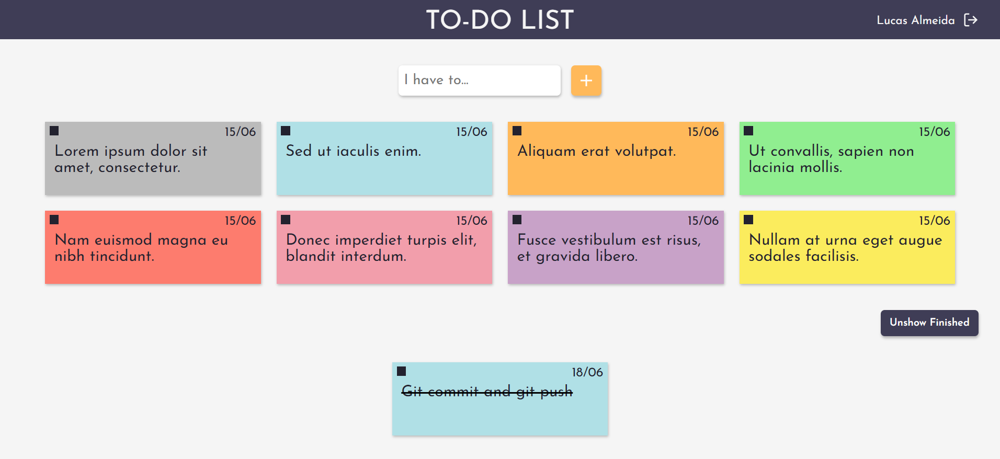
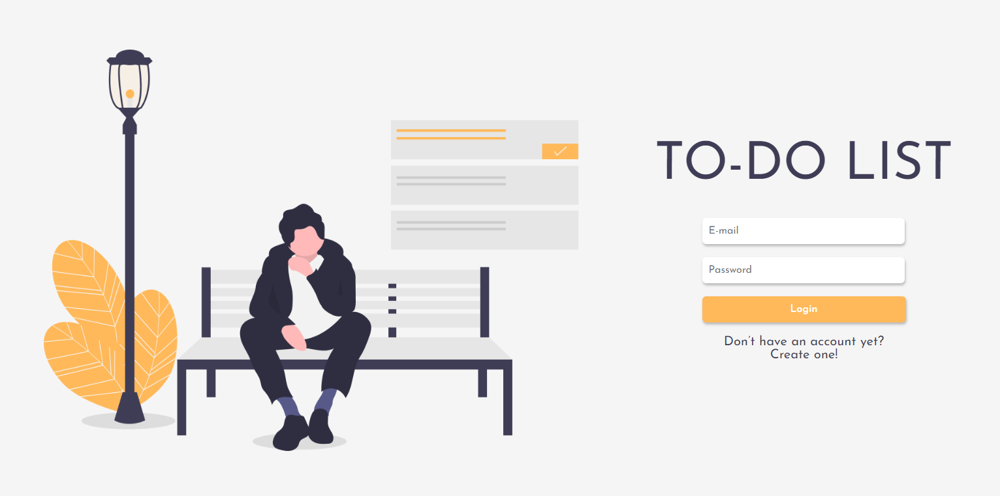
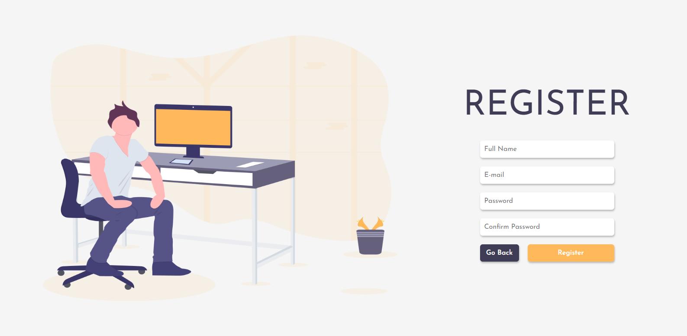

<div align="center">
  <h1 align="center"> 
    
  </h1>

<p>Esse projeto foi desenvolvido originalmente em javascript puro, e então, a fim de estudar melhor a biblioteca ReactJS no front-end e Node.js no back-end (neste caso, usando o MongoDB como banco de dados), decidi replicar a maior parte do <a href="https://github.com/lucasalme1da/to-do-list">projeto original</a>, mas com tais tecnologias.</p>

<p align="center">
  <a></a>
  <a href="https://github.com/lucasalme1da"></a>
</p>

<p align="center">
  <a href="#-o-projeto">📓 O Projeto</a>&nbsp;&nbsp;&nbsp;|&nbsp;&nbsp;&nbsp;
  <a href="#-novidades">✨ Novidades</a>&nbsp;&nbsp;&nbsp;|&nbsp;&nbsp;&nbsp;
  <a href="#-tecnologias"> 🔧 Tecnologias</a>&nbsp;&nbsp;&nbsp;|&nbsp;&nbsp;&nbsp;
  <a href="#-funcionalidades">💡 Funcionalidades</a>&nbsp;&nbsp;&nbsp;|&nbsp;&nbsp;&nbsp;
  <a href="#-como-testar">🧪 Como testar</a>&nbsp;&nbsp;&nbsp;
</p>
</div>

<br>

## 📓 O Projeto

<p>O <strong>To-Do List </strong> foi criado no intuito de facilitar a organização no dia-a-dia com anotações rápidas em pequenos cartões coloridos :D </p>

<div align="center">
</img>
</div>

<br>

## ✨ Novidades

Para explorar alguns conceitos do back-end, o armazenamento de tarefas no <a href="https://developer.mozilla.org/pt-BR/docs/Web/API/Window/Window.localStorage">localStorage</a> deu lugar ao uso do MongoDB. Além disso, foi implementado um sistema de autenticação de usuário (utilizando <a href="https://www.npmjs.com/package/jsonwebtoken">jwt</a>). Sendo assim, as tarefas são relacionadas aos usuários no banco de dados.

- Página de Login
<div align="center">
</img>
</div>

- Página de Cadastro
<div align="center">
</img>
</div>

<br>

## 🔧 Tecnologias

<p> As principais tecnologias utilizadas nesse projeto:</p>

</img>
</img>
</img>

<br>

## 💡 Funcionalidades 

- Adição de tarefas em formatos de cartões;
- Alterar os cartões em até 8 cores diferentes (cinza, azul, laranja, verde, vermelho, rosa, roxo ou amarelo);
- Colocar as tarefas como finalizadas, e depois, se necessário, excluí-las.

<br>

## 🧪 Como testar

Você deve possuir o <a href="https://nodejs.org/en/download/">Node</a> instalado, bem como o <a href="https://www.mongodb.com/">MongoDB</a>. 
Feito isso, basta seguir os comandos:

  - Para instalar:
```sh
$ git clone https://github.com/lucasalme1da/to-do-list-react
$ cd to-do-list-react
```

Também é necessário gerar um hash code para incluir no arquivo ```server/src/config/auth.json``` para encriptar as senhas que irão para o banco de dados no cadastro. Após isso:

  - Inicializando back-end:
```sh
$ cd server
$ npm install && npm start
```

  - Inicializando front-end:
```sh
$ cd web
$ npm install && npm start
# Caso haja conflito de portas, basta aceitar inicializar a aplicação em outra quando for pedido.
```


<br>

---

<p align="center"> Feito com ❤ por <a href="https://www.linkedin.com/in/lucasalme1da">Lucas Almeida</a> :D </p>
